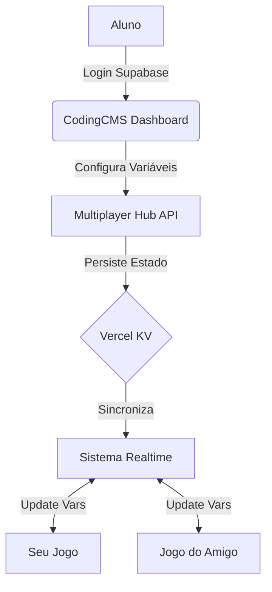

# 🏰 CodingCMS Multiplayer Hub

## 📌 Sumário
- [🚀 Fluxo de Trabalho](#-fluxo-de-trabalho)
- [🏗️ Arquitetura do Sistema](#️-arquitetura-do-sistema)
- [🕹️ Gestão de Servidores (Dashboard)](#️-gestão-de-servidores-dashboard)
- [⚡ Integração no Código (Variáveis & Realtime)](#️-integração-no-código-variáveis--realtime)
- [📄 Template de Partida Rápida (HTML)](#-template-de-partida-rápida-html)

---

> O motor de multiplayer e persistência para seus jogos. O **Supabase** é utilizado exclusivamente para a gestão de login e autenticação do sistema CodingCMS.

## 🚀 Fluxo de Trabalho

1. **Criação:** Desenvolva seu jogo no [codingcourse-livid.vercel.app](https://codingcourse-livid.vercel.app).
2. **Biblioteca:** Importe a biblioteca do Hub no seu código.
3. **Login:** Acesse o [codingcms.vercel.app](https://codingcms.vercel.app) e faça login com sua conta do CodingCourse.
4. **Configuração:** No painel do Hub, clique em **Ativar Subservidor** e crie as variáveis necessárias (ex: `playerX`, `score`, `isGameOver`).
5. **Código Secreto:** Copie o código secreto gerado pelo Hub.
6. **Integração:** No seu código do jogo, utilize o código secreto para acessar e sincronizar as variáveis.

---

## 🏗️ Arquitetura do Sistema

O sistema utiliza o **Supabase** apenas para gerenciar o login e a identidade do usuário no site do CodingCMS, permitindo o acesso seguro para a gestão de lobbies e variáveis.



---

## 🕹️ Gestão de Servidores (Dashboard)

No dashboard do Hub, você tem controle total sobre o seu "Subservidor":

1. **Ativar Subservidor:** Gera um canal de comunicação único e um código secreto de 6 dígitos.
2. **Variáveis Dinâmicas:** Adicione campos como `playerX`, `playerY`, `health`, etc. Essas variáveis ficam disponíveis instantaneamente para todos os jogadores conectados.
3. **Sincronização:** Toda alteração feita no painel é refletida em tempo real nos jogos que utilizam o código secreto.

---

## ⚡ Integração no Código (Variáveis & Realtime)

### 1. Conectar e Obter Variáveis
Ao entrar no jogo usando o código secreto, você recebe o estado inicial das variáveis definidas no painel.

```javascript
const API_URL = "https://codingcms.vercel.app/api";

async function iniciarServidor(codigoSecreto) {
  const res = await fetch(`${API_URL}/lobby/join/${codigoSecreto.toUpperCase()}`);
  const data = await res.json();
  
  if (data.error) return alert("Código inválido!");
  
  // Acessando as variáveis criadas no painel
  console.log("Variáveis iniciais:", data.variables);
  console.log("X do Player:", data.variables.playerX);
  
  // Configurar o tempo real
  conectarCanal(data.channel);
}
```

### 2. Sincronização em Tempo Real (Broadcast)
Use o canal para enviar atualizações rápidas entre os jogadores.

```javascript
let canal;

function conectarCanal(channelId) {
  canal = supabaseClient.channel(channelId);

  canal
    .on('broadcast', { event: 'update' }, (payload) => {
      // Recebe atualizações de outros jogadores
      console.log("Update recebido:", payload.payload);
    })
    .subscribe();
}

function atualizarPosicao(x, y) {
  canal.send({
    type: 'broadcast',
    event: 'update',
    payload: { playerX: x, playerY: y }
  });
}
```

---

## 📄 Template de Partida Rápida (HTML)

`````carousel
```html
<!DOCTYPE html>
<html>
<head>
    <title>CodingCMS Subserver Game</title>
    <script src="https://cdn.jsdelivr.net/npm/@supabase/supabase-js@2"></script>
    <style>
        body { font-family: 'Inter', sans-serif; background: #09090b; color: white; display: flex; flex-direction: column; align-items: center; justify-content: center; height: 100vh; margin: 0; }
        .card { background: rgba(255,255,255,0.05); padding: 2rem; border-radius: 20px; border: 1px solid rgba(255,255,255,0.1); text-align: center; }
        input { background: #18181b; border: 1px solid #27272a; color: white; padding: 12px; border-radius: 10px; margin-bottom: 1rem; width: 220px; text-align: center; font-family: monospace; }
        button { background: #3b82f6; color: white; border: none; padding: 12px 24px; border-radius: 10px; cursor: pointer; font-weight: bold; }
    </style>
</head>
<body>
    <div class="card">
        <h1>🎮 Ativar Subservidor</h1>
        <input type="text" id="code" placeholder="CÓDIGO SECRETO (6 dígitos)">
        <br>
        <button onclick="conectar()">ENTRAR NO JOGO</button>
        <div id="vars" style="margin-top: 2rem; font-size: 0.9rem; color: #60a5fa;"></div>
    </div>

    <script>
        async function conectar() {
            const code = document.getElementById('code').value.toUpperCase();
            const res = await fetch(`https://codingcms.vercel.app/api/lobby/join/${code}`);
            const data = await res.json();
            
            if (data.error) return alert("Erro: " + data.error);

            // Exibindo variáveis do painel
            const varsDiv = document.getElementById('vars');
            varsDiv.innerHTML = "<b>Variáveis do Painel:</b><br>";
            for (let [k, v] of Object.entries(data.variables)) {
                varsDiv.innerHTML += `${k}: ${v}<br>`;
            }
        }
    </script>
</body>
</html>
```
`````

---

*Powered by CodingCMS & Supabase (Auth only)*
